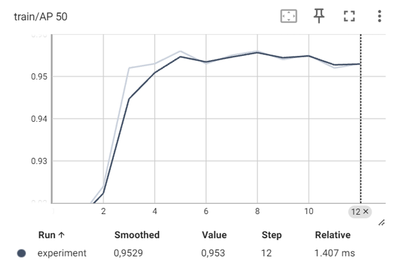

This repository contains a complete pipeline for training and evaluating an object detection model using Faster R-CNN and RetinaNet with a ResNet-50 backbone. 

# Features

✔️ Dataset Preparation:

- Organizes images and labels into separate directories (img/ and label/).
- Renames and sorts files for consistency.
- Adjusts class labels (+1) to account for background class.
  
✔️ Custom PyTorch Dataset:

- Implements AnimalDataset, a PyTorch dataset class to load images and annotations.
- Converts bounding boxes from YOLO format to absolute coordinates.
  
✔️ Model Training:

- Loads a pretrained Faster R-CNN ResNet-50 model and fine-tunes it on the dataset.
- Splits data into 70% train, 20% test, and 10% validation.
- Uses SGD optimizer with momentum and weight decay.
- Implements a learning rate scheduler.
- Supports training on GPU.

✔️ Evaluation & Logging:

- Evaluates performance on test and validation sets.
- Logs training progress using TensorBoard.
- Saves model checkpoints after each epoch.
  
✔️ Testing:

- Performs quantitative evaluation on test data.
- Conducts qualitative testing on sample images.

# Dataset

The models were trained on the AfricanWildlife Dataset --> https://www.kaggle.com/datasets/biancaferreira/african-wildlife , which was sourced from the Kaggle platform.
This dataset was manually created by collecting images from Google and labeling them in the YOLO format. It represents four species commonly found in South African nature reserves: Buffalo, Elephant, Rhino, and Zebra.

The dataset is organized into four separate folders, each corresponding to a specific class. It contains:

- 377 images for Buffalo and Elephant
- 380 images for Rhino and Zebra

Each dataset sample consists of a JPEG image and a corresponding text file containing annotation data in YOLO format. The .txt files store class labels and bounding box coordinates, structured according to the YOLO annotation system.

# Experiment phase

We trained both models (Faster R-CNN and RetinaNet) using various weight decay values, monitoring the loss and mAP curves over 15 epochs. For both models, the training phase concluded after 12 epochs, as no significant improvements were observed after this point.

## FasterRCNN

For Faster R-CNN, with weight decay = 0.001 and weight decay = 0.0001, the model achieved good convergence and learned quickly to identify objects, with a plateau in the mAP metrics after a few epochs.
## Loss Train 

## Loss AP 0.50 

## Loss AP 0.50:0.95

## RetinaNet

For RetinaNet, with weight decay = 0.001 and weight decay = 0.0001, the behavior was similar: the model learned quickly, reaching stable convergence after the initial epochs and showing small oscillations in the mAP metrics.

## Loss Train

## Loss AP 0.50

## Loss AP 0.50:0.95

# Pre-trained weights

The weights provided are available for direct use in your experiments. Simply download the provided weights and use them to run inference or fine-tune the models on your own data.
You can find the weights at the following link drive --> https://drive.google.com/drive/folders/111IgjYV68_NPVwJrC7_JUZ6M41rRikLw?usp=sharing 

# Quantitative Tests

The models were evaluated using the mAP (mean Average Precision) metric at the IoU (Intersection over Union) threshold of 0.50:0.95 and 0.50.

## IoU = 0.50:0.95

## IoU = 0.50

Based on the quantitative test results, we can conclude that the RetinaNet model outperformed the Faster R-CNN model across all considered classes, both with IoU equal to 0.50:0.95 and with IoU equal to 0.50.

In particular, we observe that RetinaNet achieved higher AP values in all classes with IoU 0.50:0.95, highlighting better object detection accuracy under more stringent conditions.
However, with IoU 0.50, the results are more "close." We see that Faster R-CNN has a slight advantage in some classes. This indicates that, although RetinaNet is generally more precise, Faster R-CNN can be very competitive in less strict scenarios.

# Qualitative Tests
In addition to the quantitative tests, we conducted qualitative tests to compare the performance of the Faster R-CNN and RetinaNet models. Below, we present predictions on a set of 5 images for each class, showing the predicted bounding boxes, the predicted label, and the associated confidence scores.

Here is the mapping between numbers and object classes:

1 → Buffalo
2 → Elephant
3 → Rhino
4 → Zebra

